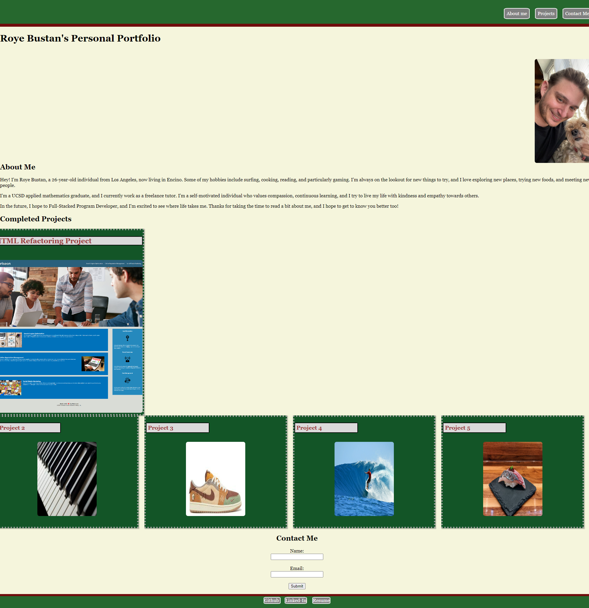

# Roye-Portfolio

## Description
This repository is designed to showcase ability to create a personal portfolio using 
HTML and CSS elements and design, with various links to other personal information. This site will be continuously updated.

## Installation
* Most recent version of VS code

## Usage

This Website will be used to store other projects as well as personal info as it updates.

## Credits

* Rbustan0 (Roye Bustan)

## License

* MIT license

## Deployment

[Link to Deployed Webpage](https://rbustan0.github.io/Roye-Portfolio/)  

[Link to Github User](https://github.com/Rbustan0)   

